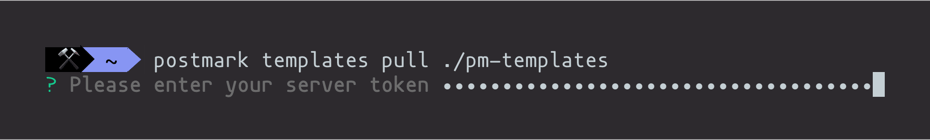
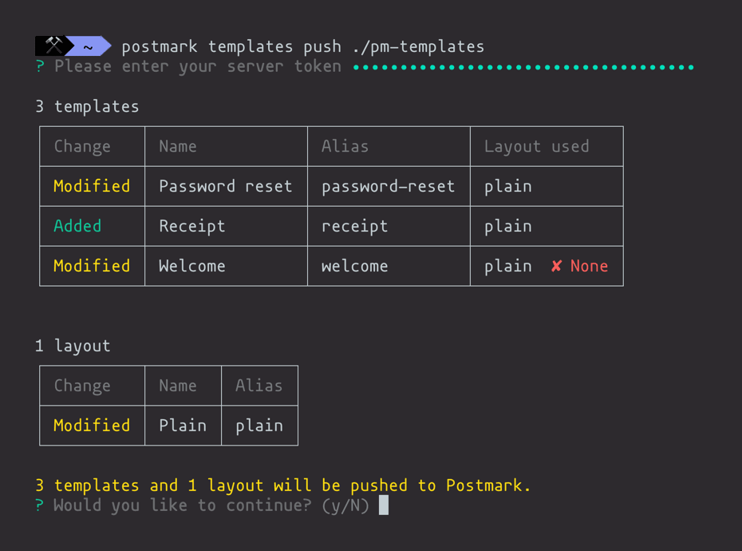

<p align="center">
  
</p>

<h1 align="center">Postmark CLI</h1>
<p align="center">A CLI tool for managing templates, sending emails, and fetching servers on <a href="https://postmarkapp.com">Postmark</a>. Nifty for integrating with Postmark via a CI/CD pipeline.</p>

<p align="center">
  <a href="https://circleci.com/gh/wildbit/postmark-cli"></a>
  <a href="https://badge.fury.io/js/postmark-cli"></a>
</p>

# Install

- Install [Node.js](https://nodejs.org/en/)
- `$ npm i postmark-cli -g`
- `$ postmark`

# Usage

```bash
$ postmark

  Commands:
    postmark email <command> [options]      Send an email
    postmark servers <command> [options]    Manage your servers
    postmark templates <command> [options]  Pull and push your templates

  Options:
    --version  Show version number
    --help     Show help
```

## Authentication

Each command requires a [server or account token](https://postmarkapp.com/support/article/1008-what-are-the-account-and-server-api-tokens) for authentication. Pass `POSTMARK_SERVER_TOKEN` or `POSTMARK_ACCOUNT_TOKEN` as environment variables.

```
$ POSTMARK_SERVER_TOKEN=123 email raw [options]

$ POSTMARK_ACCOUNT_TOKEN=123 servers list [options]
```

If a token is not supplied in the environment variable, you will be prompted for your server or account token depending on the level of access needed.



## postmark email _&lt;command&gt;_

Send an email via Postmark.

### raw

Send an email with the HTML or Text body defined.

```bash
$ postmark email raw --from="" --to="" --subject="howdy" --htmlbody="<h1>Hi there</h1>" --textbody="Hi there"

# Options
--from, -f  Email address you are sending from. Must be an address on a
            verified domain or confirmed Sender Signature. [string] [required]
--to, -t    Email address you are sending to               [string] [required]
--subject   The subject line of the email                  [string] [required]
--htmlbody  The HTML version of the email                             [string]
--textbody  The text version of the email                             [string]
```

### template

Send a templated email.

```bash
$ postmark email template --alias="" --from="" --to="" --model='{"name": "Jane"}'

# Options
--id, -i     Template ID                                              [string]
--alias, -a  Template Alias                                           [string]
--from, -f   Email address you are sending from. Must be an address on a
             verified domain or confirmed Sender Signature.[string] [required]
--to, -t     Email address you are sending to              [string] [required]
--model, -m                                                           [string]
```

## postmark servers _&lt;command&gt;_

### list

Fetch a list of servers on an account.

```bash
$ postmark servers list

# Options
--count, -c   Number of servers to return                             [number]
--offset, -o  Number of servers to skip                               [number]
--name, -n    Filter servers by name                                  [string]
```

## postmark templates _&lt;command&gt;_

Provides a push and pull workflow for your email templates. This lets you store your templates in version control and push to Postmark via a CI/CD pipeline.

**⚠️ Before you get started**, make sure that all of your templates have an alias. Check out our [help doc](https://postmarkapp.com/support/article/1117-how-do-i-use-a-template-alias) for more info.

### pull _&lt;output directory&gt;_

Download templates from a Postmark server to your local file system.

```bash
$ postmark templates pull ~/Desktop/my_templates
```

Here’s an example of the directory structure that is downloaded:

```bash
my_templates
├── password_reset
│   ├── content.html
│   ├── content.txt
│   └── meta.json
└── welcome
    ├── content.html
    └── meta.json
```

Each template is in its own directory with the HTML and Text versions as well as meta data. The meta data lets you update the template’s name, subject, and alias.

**NOTE:** If you update the template alias in `meta.json`, be sure to update the template's directory name as well. This ensures that there aren’t any conflicts down the line when pulling templates.

### push _&lt;templates directory&gt;_ [options]

Pushes templates from the local file system to Postmark.

```bash
$ postmark templates push ~/Desktop/my_templates
```

By default, you will be asked to confirm your changes before pushing to Postmark.



You can disable push confirmations by setting `-c` to `false`.

```bash
$ postmark templates push ~/Desktop/my_templates -c=false
```

# License

The MIT License (MIT) 2019 [Wildbit](https://wildbit.com). Please have a look at the [LICENSE.md](LICENSE.md) for more details.
